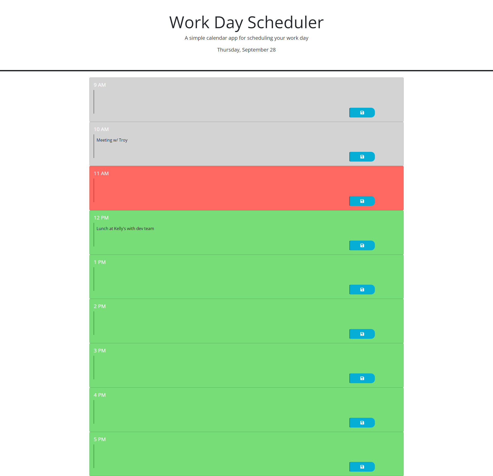

# Work Day Scheduler

## Description

This is a schedule application that will allow the user to add tasks to their daily work schedule. This project was created with HTML, CSS and jQuery.

## Usage

The user can add a note to a specific hour block by clicking in the text box for that hour, typing the note and clicking on the save icon on the right side.

Here is the live website. [Try it out!](https://shanna-not-shawna.github.io/work-day-scheduler/)

## Credits

Dominique Meeks Gombe provided tutoring and guidance on this project.

## How to Contribute

If you would like to contribute to this project, please reach out to the author.